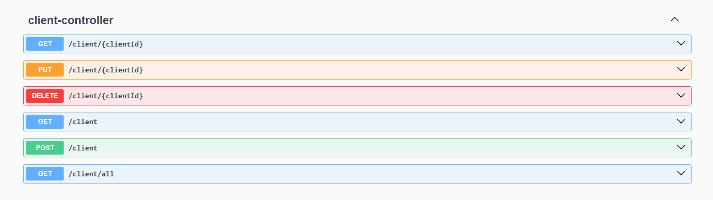
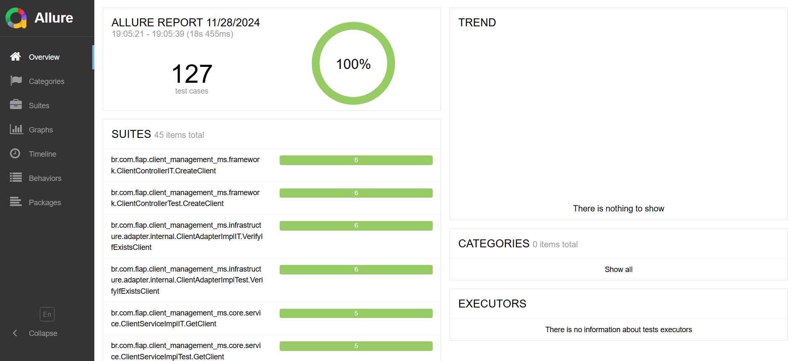
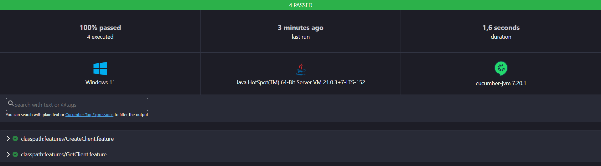
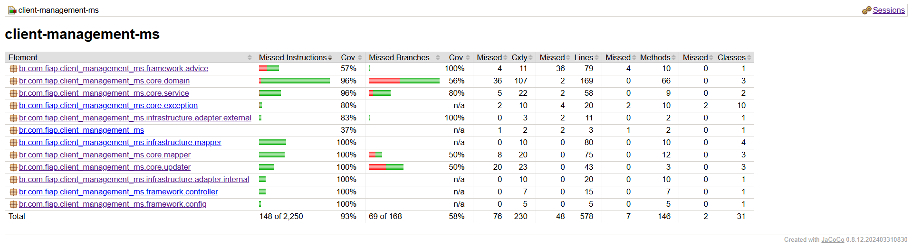

# Tech Challenge - Fase 4 - Sistema de Gerenciamento de Pedidos

## Pós Tech - Arquitetura e Desenvolvimento Java - Fiap - 2024

**Microsserviço desenvolvido por:** Welder Ressutti

- **Grupo 11:**
    - Pedro Ono - RM 354950
    - João Pedro Albuquerque dos Santos - RM 355211
    - Elton Xavier Souza - RM 354254
    - Welder Ressutti - RM 99070

## Microsserviço de Gerenciamento de Clientes

Este microsserviço foi desenvolvido seguindo os padrões de **API RESTful**, arquitetura **hexagonal** com foco em isolar
o **core** da aplicação dos elementos externos, e também respeitando os princípios **SOLID** de isolamento de
responsabilidades.

Sua responsabilidade dentro do sistema de gerenciamento de pedidos é de realizar o gerenciamento de clientes, realizando
operações **CRUD**.

Foi utilizado banco de dados relacional **PostgreSQL** para persistência dos dados, integrado com gerenciamento de
migração de schemas usando **Flyway**.

Foram criadas exceções personalizas que são tratadas globalmente pelo **Rest Controller Advice** e **Exception
Handler**, que retorna uma classe de erro contendo **timestamp**, **status code**, **error**, **message** e **path**.

Possui integração por comunicação síncrona utilizando **OpenFeign** com a API **ViaCEP** para obter o endereço completo.

## Funcionalidades e Endpoints

### Criação de Cliente (POST)

**Endpoint:** ``/api/client``

É realizado validação completa e limpeza dos dados de entrada utilizando padrões **RegEx**, impedindo inconsistência de
dados. Todos os dados da requisição são **obrigatórios** e os campos de **celular**, **CPF** e **CEP**, podem ser
enviados formatados ou não. Já na camada **core** da aplicação, dentro da classe de domínio **CPF**, é utilizado um
algoritmo que verifica se o **CPF** é válido/verdadeiro.

Exemplo de formatações aceitas:
``
Celular: 11-111111111 ou 11111111111 | CPF: 111.111.111-11 ou 11111111111 | CEP: 11111-111 ou 11111111
``

O usuário deve informa apenas o **CEP** e **número** do seu endereço, as demais informações do endereço serão
preenchidas automaticamente através da integração com a API **ViaCEP**.

O sistema **impede** o cadastro de cliente com **CPF** e/ou **e-mail** iguais.

### Atualização de Cliente (PUT)

**Endpoint:** ``/api/client/{clientId}``

Todo o padrão de validação, limpeza e consistência de dados do processo de cadastro se matém aqui também, porém, aqui
todos os campos são **opcionais**, pode ser enviado apenas **um**, **alguns** ou **todos** os campos para a atualização
do cliente.

### Leitura de Cliente (GET)

**Endpoint:** ``/api/client/{clientId}`` ``/api/client?email=`` ``/api/client/all``

Pode ser obtido o cliente pelo seu **id** ou **e-mail**. Também é possível obter **todos** os clientes de uma vez.

### Deleção de Cliente (DELETE)

**Endpoint:** ``/api/client/{clientId}``

Para deletar um cliente basta passar seu **id** no endpoint.

*Para mais informações sobre a API, como, request, response e status code, consultar a documentação Swagger.*

## Arquitetura

A arquitetura hexagonal consiste na ideia de utilizar portas e adaptadores para realizar a integração entre a camada
externa e interna, isolando o core da aplicação para que alterações externas não interfiram na regra de negócio e casos
de uso.

Essa aplicação foi arquitetada da seguinte forma:

## Executando a aplicação

### Pré-requisitos

- **Git** (caso queira clonar o repositório, mas você pode apenas baixá-lo):
    - [Git](https://git-scm.com/downloads)
- **Docker Desktop** (para executar a aplicação através de containers):
    - [Docker](https://www.docker.com/products/docker-desktop/)

### Passo 1: Clonar ou baixar o repositório

Para clonar o repositório, use o comando:

```bash
git clone https://github.com/welderessutti/client-management-ms.git
```

Caso não queira clonar o repositório, você pode baixá-lo
em [GitHub](https://github.com/welderessutti/client-management-ms).

### Passo 2: Executar a aplicação com Docker

#### Ambiente de Produção (prd):

No terminal, dentro do diretório raíz do projeto (local onde se encontra o arquivo **pom.xml** da aplicação), execute o
comando abaixo para subir o container da aplicação e do banco de dados **PostgreSQL**:

```bash
docker compose up -d
```

O Docker tentará baixar a imagem no repositório do [Docker Hub](), caso ele não encontre a imagem, ele realizará a
**build** da aplicação **(.jar)**, criará a imagem e executará os containers automaticamente.

Antes do container da aplicação subir, ele aguardará o container do banco de dados **PostgreSQL** estar pronto
utilizando um **healthcheck**, quando pronto, o container da aplicação inicia, e realizará a migração do banco de dados
e suas tabelas automaticamente utilizando o **Flyway**, e estará disponível para acesso em:

```
http://localhost:8080/api/client
```

## Documentação da API (Swagger UI)

A documentação da **API** pode ser acessada via **Swagger UI**. Após executar a aplicação, acesse:

```
http://localhost:8080/api/swagger-ui/index.html
```

Lá você encontrará detalhes sobre todos os endpoints disponíveis, parâmetros de requisição e resposta.



## Testes

Práticas de TDD (Test-Driven Development) e BDD (Behavior-Driven Development) foram utilizadas ao longo do
desenvolvimento para criar testes unitários, de integração, de sistema e de comportamento, totalizando mais de **120**
testes e mais de **90%** de coverage, segundo relatório do **Jacoco** e **Allure**.

Foram utilizadas a bibliotecas **JUnit 5**, **Mockito**, **REST-Assured** e **Cucumber** com linguagem **Gherkin**.

Foram criados 4 tipos de perfis de teste, **unit-tests**, **integration-tests**, **behavior-tests** e **all-tests**.

### Executando os testes unitários e de integração

#### Pré-requisitos

- **Maven** (somente para os testes):
    - [Maven](https://maven.apache.org/download.cgi)

#### Testes unitários

Utilizando seu terminal, dentro do diretório raíz do projeto (local onde se encontra o arquivo **pom.xml** da
aplicação), execute o comando abaixo para executar os testes unitários com o perfil **unit-tests**:

```bash
mvn clean test -Punit-tests
```

#### Testes de integração

Utilizando seu terminal, dentro do diretório raíz do projeto (local onde se encontra o arquivo **pom.xml** da
aplicação), execute o comando abaixo para executar os testes de integração com o perfil **integration-tests**:

```bash
mvn clean test -Pintegration-tests
```

### Executando os testes de comportamento (BDD) e todos os testes juntos

#### Pré-requisitos

- **Maven** (somente para os testes):
    - [Maven](https://maven.apache.org/download.cgi)
- **Docker Desktop** (para executar a aplicação através de containers):
    - [Docker](https://www.docker.com/products/docker-desktop/)

#### Passo 1: Executar a aplicação com Docker

##### Ambiente de Staging (stg):

Antes de realizar o teste de sistema ou todos os testes juntos, é necessário executar a aplicação utilizando o ambiente
**stg**.

Para isso, execute o comando abaixo conforme o shell que você estiver utilizando, para incluir a variável de ambiente e
executar a aplicação com o ambiente **stg**:

**Caso você já tenha executado a aplicação com o ambiente **prd** e não tenha excluído os containers, pare e exclua os
containers antes de executar a aplicação com o ambiente **stg***.

##### Windows (PowerShell)

```powershell
$env:PROFILE="stg"; docker-compose up -d
```

##### Windows (CMD)

```cmd
set PROFILE=stg && docker-compose up -d
```

##### Linux ou macOS (Bash)

```bash
PROFILE=stg docker-compose up -d
```

#### Passo 2: Executar os testes

##### Testes de comportamento (BDD)

Após executar a aplicação com o ambiente **stg**, utilizando seu terminal, dentro do diretório raíz do projeto (local
onde se encontra o arquivo **pom.xml** da aplicação), execute o comando abaixo para executar os testes de comportamento
com o perfil **behavior-tests**:

```bash
mvn clean test -Pbehavior-tests
```

##### Todos os testes juntos

Após executar a aplicação com o ambiente **stg**, utilizando seu terminal, dentro do diretório raíz do projeto (local
onde se encontra o arquivo **pom.xml** da aplicação), execute o comando abaixo para executar todos os testes com
o perfil **all-tests**:

*Caso você já tenha executado os *testes de comportamento*, você deve parar e excluir os containers antes, e subi-los
novamente em ambiente **stg**, caso contrário, o teste de comportamento falhará devido a uma regra de negócio da
aplicação.*

```bash
mvn clean test -Pall-tests
```

## Relatórios

A aplicação está configurada para gerar 3 tipos de relatórios, **Jacoco**, **Allure** e **Cucumber**.

### Allure

#### Pré-requisitos

- **Allure** (para gerar o relatório após o teste):
    - [Allure](https://allurereport.org/)

#### Passo 1: Executar os testes

Execute **qualquer um** dos testes informados anteriormente na seção de **Testes**.

#### Passo 2: Gerar o relatório

Utilizando seu terminal, dentro do diretório raíz do projeto (local onde se encontra o arquivo **pom.xml** da
aplicação), execute o comando abaixo para gerar o relatório **Allure**:

```bash
allure generate target/allure-results
```

Após gerar o relatório **Allure**, ele estará disponível no diretório raíz em: ``allure-report/index.html``



### Cucumber

#### Passo 1: Executar os testes

Execute o teste de **comportamento** informado anteriormente na seção de **Testes**. Você deve estar rodando a aplicação
em ambiente **stg**.

#### Passo 2: Abrir o relatório

Após executar o teste de comportamento, o relatório **Cucumber** é gerado automaticamente, e ele estará disponível no
diretório: ``target/cucumber-reports/cucumber.html``



### Jacoco

#### Passo 1: Executar os testes com verify do Maven

Para gerar o relatório do **Jacoco**, você deve executar o teste com o **verify** do **maven**, utilizando o comando
abaixo:

```bash
mvn clean verify
```

#### Passo 2: Abrir o relatório

Após a execução dos testes, o relatório **Jacoco** é gerado automaticamente, e estará disponível no
diretório: ``target/site/jacoco/index.html``


